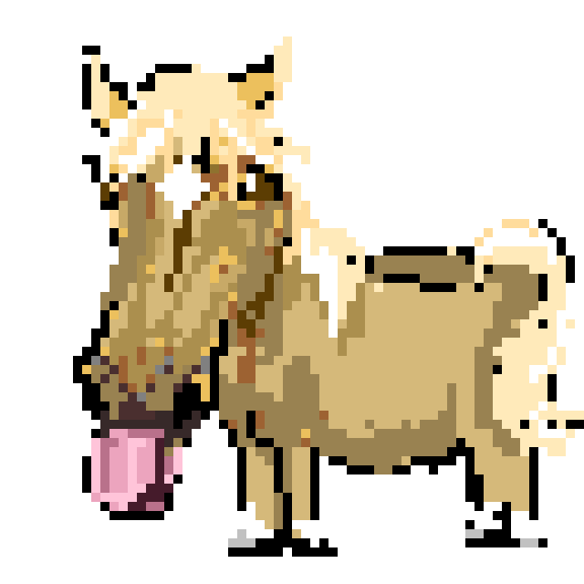
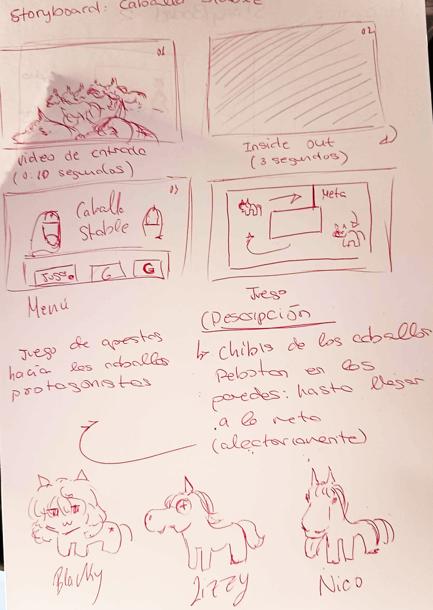

## (Nombre del proyecto)

Proyecto de Creación Multimedia Interactiva de la  Facultad de Bellas Artes de la Univesidad de Granada

# 1 Datos 

**Titulo** : Caballa Stable

**Web:**   (url github.io)

**Autor:**  Marco Luque Gomez

**Resumen** : Un simulador de apuestas de caballos, eliges el caballo que crees que va a ganar y ves como se desarrolla de manera aleatoria la carrera.

**Estilo/género:**  Juego

**Logotipo** : 

**Resolución:** 1152x648px 
**Probado en:**   Google Chrome

**Tamaño proyecto:** 41MB 

**Licencia** Este proyecto tiene una Licencia CC Reconocimiento Compartir igual (CC BY-SA)

**Fecha** : 28/05/2026

# 2. Memoria del proyecto 

### 2.1 Storyboard: 

### 2.2. Esquema de navegación 

(imagen con las distintas pantallas de navegación, usa draw.io o cualquier programa de dibujo)

# 3. Metodología

## Etapa 1: Ideación de proyecto

Mi inpiración principal fue [horse racer test](https://acemyth.itch.io/horseracetests) y [Limbus Stable](https://x.com/CursedXWT/status/1939046888684016052). Se tratan de juegos en los que debes apostar por el caballlo que crees que ganara y ver como se desarrolla la carrera de manera aleatoria. Los diseños humanizados estn inspirados en el juego movil Uma Musume.

**Motivación de la propuesta** 

Este proyecto creo que me representa muy bien, he caricaturizado a mis propias yeguas y como aficionado a las carreras de caballos y federado en equitación tenía claro que quería hacer algo relacionado con los caballos. Puede que no tenga mucho gameplay pero yo he pasado muy buenas tardes con mis amigos jugando al limbus stable con mis amigos y no sabiendo que va a pasar.

**Publico / audiencia**

- Es un juego personal para mi y mis amigos

## Etapa 2: Desarrollo / actividades realizadas

El menu es bastante simple. El gameplay toma como base un estructura de pin pon haciendo que los sprites reboten en direcciones aleatorias con las propirdades físicas de la pared, haciendo asi que ganen aleatoriamente. El menu de selección activa una variabble global diferente cuando presionas a cada caballo. Si el caballo que gana tiene la variable de seleccionado activada aparece una pantalla de ganador. En el caso contrario una de perdedor.

## Etapa 3: Problemas identificados

Hay veces que las carreras se alargan demasiado y creo que podria haber implementado dialogos o un sistema de dinero que vas ganando o perdiendo según quien gana.

# 4. Conclusiones 

Yo estoy bastante contento con mi juego porque siento que me representa personalmente. Pero me hubiera gustado humanizar a las lleguas y añadir un aspecto de novela visual entre carreras pero por falta de tiempo no se me ha hecho posible.

# 5 Referencias 

**Artículos y blogs** 

- Crofts, S., Fox, M., Retsema, A. and Williams, B. (2005) *Podcasting: A new technology in search of viable business models*First Monday, 10(9). https://doi.org/10.5210/fm.v10i9.1273. Recuperado el 8 de abril de 2020 de: https://journals.uic.edu/ojs/index.php/fm/article/view/1273/1193

**Recursos y materiales audiovisuales:**

* Musica:  Uma Musume
* Imágenes:  Marco Luque Gomez
* Tipografía: Google Fonts

**Herramientas utilizadas**

- Godot Engine 4.3

  
  </small>

Mayo 2026
